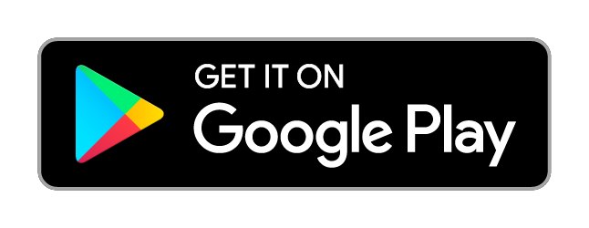

# My Superhero App ✨

A Flutter application made with love and beautiful UI. You can search your favourite hero powerstats too. It is written entirely in Dart and built with Flutter, so it can be compiled to run (very smoothly) on Android, iOS and all other platforms supported by Flutter!

## Getting Started

#### A full stack application to store / list places you have traveled.

To build and run the app on your device, do the following:

-   [Install Flutter](https://flutter.dev/docs/get-started/install/) by following the instructions on their website.
-   Clone this repo to your local machine using `git clone https://github.com/mittalsam98/super_hero_app.git`.
-   Connect your device/emulator and run the app using `flutter run` in the root of the project directory.

### Hi there 👋 I am Sachin, a full stack web and app developer 

## Contributing

Found any bugs? Have any suggestions or code improvements? [Submit an issue](https://github.com/mittalsam98/super_hero_app/issues) or fork and send a [pull request](https://github.com/mittalsam98/super_hero_app/pulls) with your changes. All contributions are more than welcome, and will be merged into `master` if satisfactory.

## buy-me-a-coffee
Liked some of my work? Buy me a coffee (or more likely a beer)

## Usage 

You can use these individual components or all of them together as a template or starting point in your own Flutter app. It's completely free - as in beer and speech!

## License

This project is licensed under the MIT License - do anything you want with it! See the [LICENSE](LICENSE) file for details.

